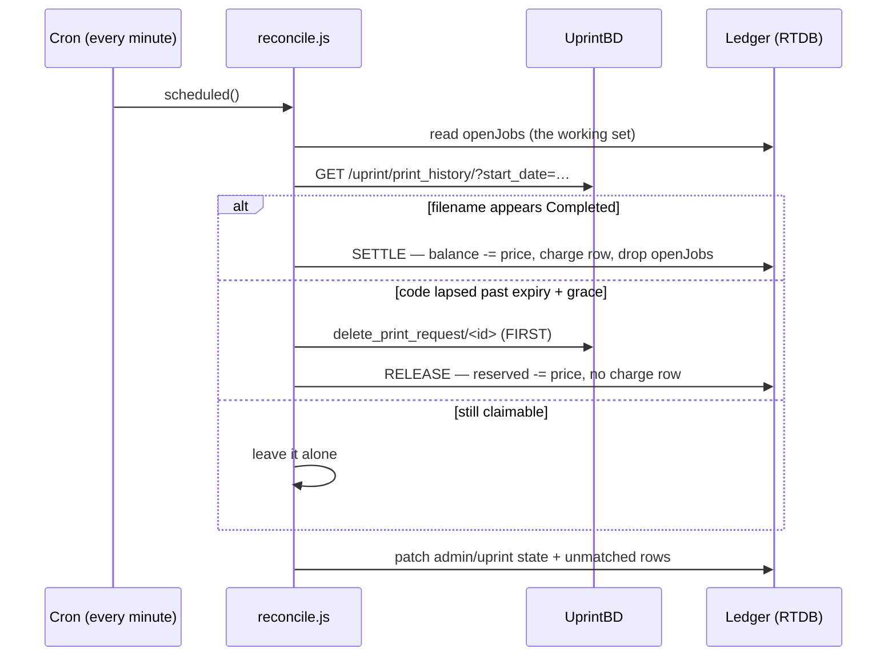

# Architecture

How the pieces fit together, what each is responsible for, and why the design is shaped
this way.

---

## 1. The big picture

Four actors, two Firebase projects, and one hard constraint.

```
┌───────────────────┐   ┌──────────────────────────────┐   ┌──────────────────┐
│ Browser           │   │ Worker  (src/worker.js)      │   │ UprintBD.com     │
│ public/           │   │   + lib/api.js               │   │ (Django site,    │
│                   │   │                              │   │  UNCHANGED)      │
│ app.js  builds    │ POST /api/print                  │   │                  │
│  the A4 PDF       │──────►│ verify ID token          │   │ /login/          │
│                   │   │   │ price + limit-check      │──►│ /uprint/uploader │
│ labddb-auth.js    │   │   │ HOLD (reserve, not charge│   │ /uprint/         │
│  Google sign-in,  │   │   │ mint OTP ────────────────┼──►│  accept_print_.. │
│  live wallet chip │◄──────│ 200 {otp, wallet}        │◄──│ /uprint/dashboard│
└───────────────────┘   │                              │   │                  │
        ▲               │ ┌── cron, every minute ────┐ │   │ /uprint/         │
        │ onValue        │ │ lib/reconcile.js         │─┼──►│  print_history/  │
        │ (own wallet)   │ │  Completed? → SETTLE     │ │   │                  │
┌───────────────┐       │ │  lapsed?    → RELEASE    │ │   └──────────────────┘
│ Firebase RTDB │◄──────┤ └──────────────────────────┘ │
│ LabDDB-Pro    │  service└──────────────────────────────┘
│ wallets/jobs  │  account          ▲
│ .write: false │                   │ custom token (coverAdmin)
└───────────────┘         ┌─────────┴────────┐
                          │ Firebase RTDB    │
                          │ lddb-demo        │
                          │ courses/students │
                          └──────────────────┘
```

**The hard constraint:** UprintBD will not provide an API. So the integration lives
entirely on our side, and its job is to *be a normal logged-in browser session* against
UprintBD's existing pages.

**The consequence that shapes everything else:** because there is no API, there is no
callback telling us a page printed. We have to go and look. That is why the money model is
reserve → settle → release rather than charge-on-mint, and why a cron job is load-bearing
rather than a nicety.

---

## 2. Why two Firebase projects

| | LabDDB-Pro | lddb-demo |
|---|---|---|
| Holds | auth, wallets, jobs, ledger, config | courses, faculty, students |
| Users sign in? | yes (Google) | **never** |
| Rules | owner-scoped read, `.write: false` | public read, `coverAdmin` write |
| Shared with | every LabDDB tool | the cover-page generators |

LabDDB-Pro is the shared identity provider for all LabDDB tools, so it is the project that
must not become a dumping ground. lddb-demo already exists with its catalogue and its
public-read expectations. Keeping them apart means the token a coverpage admin holds cannot
reach a wallet — not by policy, but because wallets are in a different project.

The browser initialises both: `firebase.initializeApp(dataConfig)` as the default app and
`initializeApp(authConfig, 'labddb-pro')` as a named one, so existing `db.ref()` calls in
the generators keep working untouched.

---

## 3. Components

### Browser (`public/`)

| File | Responsibility |
|---|---|
| `js/labddb-config.js` | both Firebase configs, bridge URL, pricing defaults, `api()` helper — one place, replacing config duplicated across five page scripts |
| `js/labddb-auth.js` | dual app init, Google sign-in sheet, **live wallet listener**, header chip, wallet sheet with statement |
| `js/app.js` | the generator: preview, edit, PDF, and the Get-OTP handler |
| `js/uprint.js` | `elementToPdfBase64()` + the OTP modal |
| `js/admin.js` | catalogue admin, behind a `coverAdmin` custom token |
| `js/console.js` | project-admin console: overview, users, jobs, ledger, pricing, reconcile |

The wallet chip is driven by an RTDB `onValue` on the user's own wallet node, not by
polling `/api/me`. When the cron settles a print, the balance updates on its own — which
is exactly the moment a student is staring at the screen wondering whether they were
charged.

### API (`lib/api.js`)

One module, both runtimes. `src/worker.js` (Cloudflare, production) and `server.js` (Node,
local dev) are thin adapters over plain Fetch `Request` → `Response`. Anything that moves
money or touches UprintBD is written **once**, so a bug fixed locally is a bug fixed in
production.

Holds the route table (19 paths), the three auth tiers, and the context object that lazily
builds the RTDB client, the UprintBD session and the job queue per isolate.

### Money (`lib/ledger.js`)

The only code that changes a balance. `priceJob`, `hold`, `settle`, `release`, `topUp`,
`adjust`, `checkLimits`, plus id and filename generation. See §5.

### Settlement (`lib/reconcile.js`)

The only code that *drops* a balance, and the only consumer of `print_history`. See §6.

### Firebase (`lib/firebase-rest.js`)

Firebase without `firebase-admin`, which is Node-only and cannot run on Workers:
service-account JWT (RS256 via WebCrypto) → OAuth token, cached; RTDB REST with
`X-Firebase-ETag`/`if-match` for compare-and-swap; custom-token minting. Isomorphic.

### Identity (`lib/auth-verify.js`)

ID token → trusted identity via Identity Toolkit `accounts:lookup`, cached 60 s in-isolate.
`isProjectAdmin()` is an email comparison against the verified identity.

### UprintBD (`lib/uprint-bridge.js`)

The only module that knows UprintBD exists. Every URL, cookie, CSRF token, payload field
and scraping regex is quarantined here behind a stable contract. If an official API ever
arrives, this file's internals get swapped and nothing else changes.

---

## 4. Request lifecycle — "Get Kiosk OTP"

```mermaid
sequenceDiagram
    participant B as Browser
    participant A as Worker (api.js)
    participant L as Ledger (RTDB)
    participant U as UprintBD

    B->>B: elementToPdfBase64(coverPage)
    B->>A: POST /api/print + Bearer idToken
    A->>A: verify token (Identity Toolkit, cached)
    A->>A: validate %PDF-, size; count pages from the PDF
    A->>L: checkLimits (holds, per-hour, pages, copies)
    A->>L: HOLD price — balance unchanged, reserved += price
    A->>L: write job + openJobs + printIndex
    Note over A,L: paper trail BEFORE the spend,<br/>so a crash is still discoverable
    A->>U: upload → accept_print_info → scrape OTP
    U-->>A: otp, recordId
    A->>L: patch job/openJobs: reserved, recordId, expiresAt
    A-->>B: 200 {otp, wallet:{balance, reserved, available}}
    B->>B: OTP modal; chip shows the new available
```

Then, separately, up to a minute later:



The two orderings in that diagram are load-bearing, and both are explained in §6.

---

## 5. The money model

### Three states, and only one of them costs anything

```
mint ──► reserved ──┬──► printed    balance -= price   (a charge row)
                    ├──► expired    reserved -= price  (no row at all)
                    ├──► cancelled  reserved -= price  (no row at all)
                    └──► failed     reserved -= price  (no row at all)
```

`available = balance − reserved` is the only number shown to a student. A hold moves
`available` and leaves `balance` alone, so the UI can be honest about both: *"৳10, ৳3 of it
committed to a code you haven't used."*

An expiry writes **no ledger row**. A charge that never happened should not need a matching
refund to cancel it out — a statement full of `+3 / −3` pairs for codes nobody used is a
statement nobody can read.

### Exactly-once, without transactions

RTDB REST has no multi-path transaction. Everything goes through one primitive:

```js
applyToWallet(rtdb, uid, opId, mutate)   // CAS on /wallets/{uid} by ETag
```

which writes the **idempotency key into `wallet.applied` in the same node in the same
compare-and-swap that moves the numbers**. The key and the balance therefore cannot
disagree — they are one write. A replay finds its own `opId` present and returns the prior
result without touching anything.

That single property is what makes the cron safe to run every minute, `Force settle` safe
to double-click, and a half-finished mint safe to retry. `applied` is pruned by TTL and
count so the node cannot grow without bound.

`scripts/test-ledger.js` proves it against an in-memory RTDB that reproduces ETag CAS —
including a **forced** race (a second writer completes between the first's read and its
write) so the retry path genuinely runs rather than being assumed.

### Three prices, never conflated

- **declared** (3/5) → `total_cost` on the UprintBD payload, mirroring their own
  `calculateCost()` so our request looks like the browser's;
- **actual** (2.0 observed) → scraped from history into `actualCost`; our cost of goods;
- **charged** → `/config/pricing`, the only price a student ever sees.

The reconciler never lets `actualCost` change `price`. The price is stored **on the job** at
mint time, so a price change mid-hold cannot alter what a student was quoted.

---

## 6. Settlement

`print_history` is the only source trusted to say a page printed. Everything else — the
dashboard, the OTP's existence, the passage of time — can only cause a release.

**Ordering 1: settle before expire.** A job can be past its expiry *and* printed, because
the history row lands a moment after the code is used. Checking history first means we
never release money for a page that came out.

**Ordering 2: delete the UprintBD record, then release.** Reversed, there is a window
where the OTP still works at a kiosk but we have already handed the money back — the
institution eats the cost. If the delete fails we keep the hold and retry next pass.

**No history, no decisions.** If `print_history` cannot be read, the pass records the error
and touches nothing. Expiring a hold on missing evidence would charge nobody for a page
that printed.

**The leak detector.** Every filename ever sent to UprintBD is in `/printIndex`. A
`Completed` row that is not there was printed against the institutional account by
something outside this app, so nobody's wallet covered it: it lands in
`admin/uprint/unmatched` and on the console's overview. That counter must stay at zero.

**Two triggers, one lease.** The cron runs every minute; `/api/print` runs a pass inline
when the last one is over 3 minutes old, so a broken cron delays settlement instead of
freezing balances. A 90-second lease in RTDB stops the two from scraping the same site
twice — not for correctness (idempotency already covers that) but for politeness.

---

## 7. Key design decisions

**Zero dependencies.** Node ≥ 20 and Workers both ship `fetch`, `FormData`, `Blob`,
`crypto.subtle` and `Headers.getSetCookie()`. No Puppeteer (heavy, fragile), no
`firebase-admin` (Node-only, so it would have split the codebase in two), no axios/cheerio.
Installs in seconds, no supply-chain surface, trivially auditable.

**One codebase, two runtimes.** `lib/api.js` speaks plain Fetch types. The Worker and the
Node server are adapters. The alternative — separate implementations — guarantees that the
thing you tested locally is not the thing that moves money.

**One institutional session + a job queue.** Students don't have UprintBD accounts; one
blessed account prints for everyone. But a single session cannot safely be mid-upload
twice: the record id arrives on a redirect, so overlapping uploads could attribute the
wrong OTP to a job. So UprintBD work is serialised through a promise chain. Ledger writes
run in parallel — CAS makes them safe.

**Constant-cost admin reads.** `/api/admin/*` reads whole subtrees (three RTDB calls for
the entire jobs table) rather than one call per row, because Workers' free tier caps a
request at 50 subrequests. A busy day must not break the console.

**Filename as the join key, generated server-side.** `print_history` has no record-id
column, so the filename is the only link from a history row to the person who pays. The
client does not get to choose it: a job-id suffix is appended so two students printing the
same cover on the same day are distinguishable.

**Server-side page counting.** Pages come from the PDF bytes, not the request body. A
client that could declare "1 page" would print 20 for the price of one.

**Sign-in only where money moves.** Browsing, generating and downloading a PDF stay
anonymous. Only the kiosk action needs an account, because only it spends.

---

## 8. Failure handling

| Where | Failure | Behaviour |
|---|---|---|
| auth | no/expired/foreign token | `401`/`403`, message written for a student to read |
| `/api/print` | bad PDF, over 15 MB | `400`/`413` before any spend |
| `/api/print` | insufficient balance | `402` **with** `required`/`available`, so the UI needs no second call |
| `/api/print` | over a limit | `429` naming what was hit |
| `/api/print` | UprintBD throws after the hold | hold released immediately, `502`, "Your balance was not touched." |
| `/api/print` | crash between hold and OTP | job + `openJobs` + `printIndex` already written; the reconciler releases it as `failed` after 3 min |
| `/api/cancel` | UprintBD won't delete | hold **kept**, `502` explaining it returns at expiry |
| reconcile | history unreadable | nothing settled, nothing released, error recorded |
| reconcile | delete fails | hold kept, `failedDeletes++`, retried next pass |
| reconcile | one job throws | recorded per-job; the other jobs still process |
| reconcile | cron down | `/api/print` reconciles inline once stale |
| any route | unknown error | stack logged server-side; `Something went wrong on our side.` to the browser |
| any route | secret missing | `503` naming the subsystem, never a half-configured spend |
| engine | markup drift | throws with the HTTP status and Django's leaked `exception_value` |
| engine | OTP not rendered yet | one 900 ms retry, then throws |

The pattern throughout: **when in doubt, keep the hold.** A held taka is visible, explains
itself in the UI, and is released by the next successful pass. A wrongly released one is
gone, and someone printed for free.

---

See [UPRINT-PROTOCOL.md](UPRINT-PROTOCOL.md) for the wire-level flow, [API.md](API.md) for
response shapes, [SECURITY.md](SECURITY.md) for the threat model, and
[PRODUCTION-SETUP.md](PRODUCTION-SETUP.md) for deployment.
