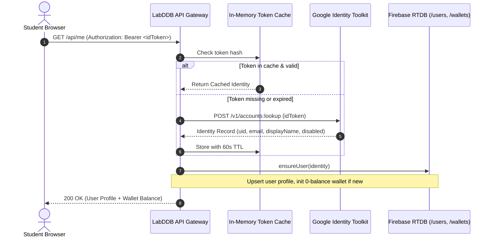

# Authentication Architecture

## 1. Overview & Zero-Dependency Philosophy

Authentication verifies the identity of every student and administrator accessing the platform. In keeping with the zero-external-dependency requirement:

- **No Firebase Admin SDK**: The standard `firebase-admin` Node package pulls in hundreds of transitive dependencies and cannot execute natively in Cloudflare Workers.
- **Direct Google Identity Toolkit REST**: Token verification calls Google's authoritative Identity Toolkit endpoint `https://identitytoolkit.googleapis.com/v1/accounts:lookup?key=<API_KEY>`.
- **In-Memory Verification Cache**: Tokens are cached in-isolate for 60 seconds (or until expiration) to minimize round-trips to Google servers.

---

## 2. Authentication Flow



---

## 3. ID Token Verification Specifications

### Bearer Token Parsing
Tokens must arrive in the standard HTTP `Authorization` header:
```http
Authorization: Bearer <Firebase_ID_Token>
```
If missing or improperly formatted, `401 Unauthorized` is returned immediately with `"Sign in to continue."`

### In-Memory Cache Keying
Tokens are keyed by their SHA-256 hash or raw string in a bounded map. Each entry records:
```javascript
{
  identity: {
    uid: "user_12345",
    email: "student@cu.ac.bd",
    emailVerified: true,
    displayName: "Student Name",
    photoURL: "https://...",
    disabled: false
  },
  expiresAt: Math.min(Date.now() + 60000, jwtPayload.exp * 1000)
}
```

### Disabled Account Detection
If `identity.disabled === true` in Google Identity Toolkit or `users/<uid>/disabled === true` in RTDB, the request is refused with `403 Forbidden`:
`"This account has been disabled. Please contact the administrator."`

---

## 4. Custom Token Minting for `lddb-demo` (Academic Catalogue)

To allow authorized admins to edit courses and faculties in the separate `lddb-demo` project without sharing project credentials:

1. Server imports `LDDB_DEMO_SERVICE_ACCOUNT`.
2. WebCrypto generates an RS256 JWT assertion with claims:
   - `iss`: service account `client_email`
   - `sub`: service account `client_email`
   - `aud`: `https://identitytoolkit.googleapis.com/google.identity.identitytoolkit.v1.IdentityToolkit`
   - `uid`: target user UID
   - `claims`: `{ coverAdmin: true, email: user.email }`
3. Signs JWT using WebCrypto native `crypto.subtle.sign('RSASSA-PKCS1-v1_5')`.
4. Exchanges assertion for custom token valid for 1 hour.
