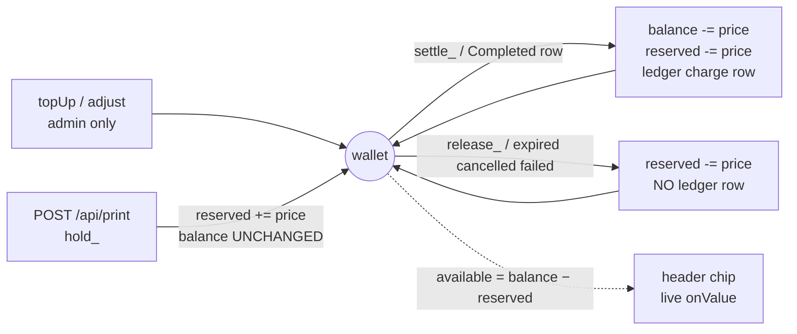
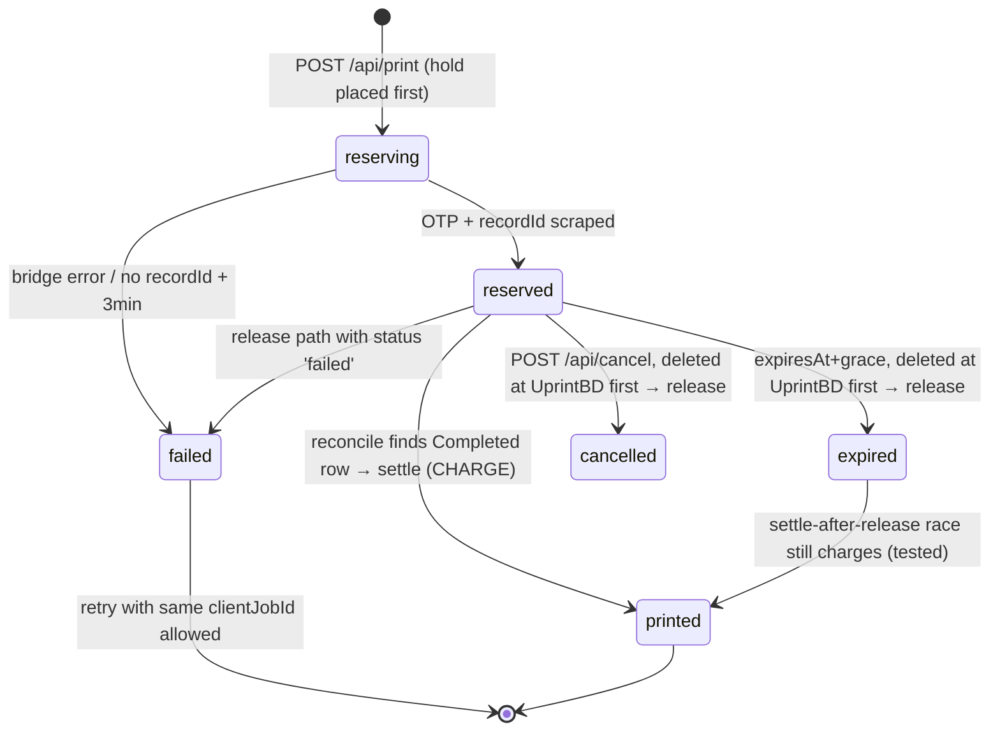
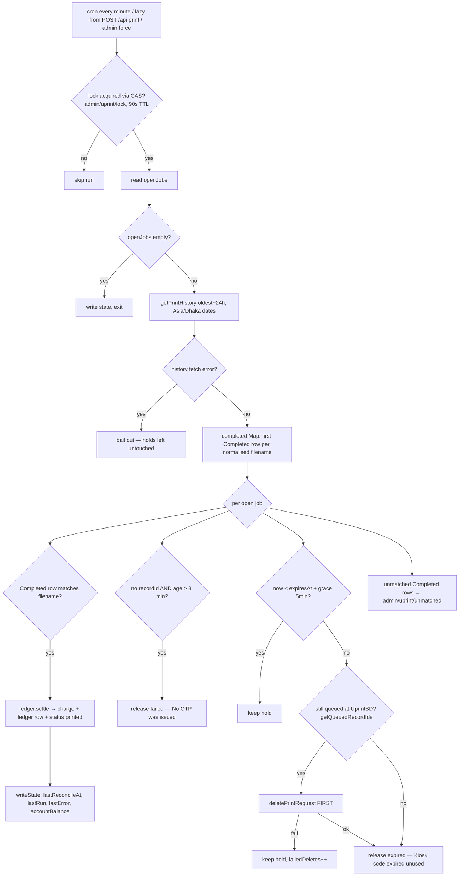

# CURRENT-SYSTEM-HANDOFF.md — Complete Reverse-Engineering & AI Handoff

> **Status of this document:** reverse-engineered from source code on 2026-09-03, at commit
> `dacf6af` ("Fix hardcoded balance gate, corrupted SVG path, and UTC date bug") plus local
> working-tree changes (uncommitted diagnostic files — see §31.4).
> Every claim is labelled **CONFIRMED** (verified in source at the cited lines), **DOCUMENTED**
> (stated in project docs, not re-verifiable from code alone), **INFERRED** (derived from
> code structure), or **NEEDS LIVE VERIFICATION** (requires a running system / live kiosk).
> Source code is the ultimate source of truth; where docs disagree with code, code wins and
> the disagreement is recorded in §24 (Discrepancies).

---

## 0. NEW AI START HERE

1. Read this document top to bottom once. Do not skip §14 (invariants).
2. The product in one sentence: a static, anonymous CU cover-page generator whose one
   money-moving button ("Get Kiosk OTP") reserves taka in a Firebase-backed wallet, drives
   UprintBD's **existing website** (no API) to mint a real kiosk OTP, and charges the student
   **only when UprintBD's own print history shows the page printed**.
3. The whole backend is ~3,400 lines of zero-dependency JS split between
   `lib/api.js` (routes), `lib/ledger.js` (all money movement), `lib/uprint-bridge.js`
   (UprintBD web automation), `lib/reconcile.js` (settle/expire engine),
   `lib/firebase-rest.js` (Firebase REST without firebase-admin), `lib/auth-verify.js`
   (ID-token verification), `lib/audit-logger.js` (D1/R2 audit archive).
4. The same `lib/api.js` runs on **Cloudflare Workers** (`src/worker.js`) and **Node**
   (`server.js`). One codebase, two runtimes.
5. Run `npm test` first — it needs no credentials and proves the wallet logic.
6. Before changing anything, read §23 (rebuild specification) and §24 (discrepancies).
   Some bugs in the current code are documented, not fixed, per the "preserve knowledge
   first" mandate.

---

## 1. Product determination

**CONFIRMED.** A Chittagong University academic-utility web app ("LabDDB") with four
cover-page generator variants and a paid printing bridge:

| Variant | Page | Script |
|---|---|---|
| Assignment cover | `public/index.html` | `public/js/app.js` |
| Experiment cover | `public/experiment-cover.html` | `public/js/experiment-cover.js` |
| Experiment main cover | `public/experiment-main-cover.html` | `public/js/experiment-main-cover.js` |
| Experiment index page | `public/experiment-index.html` | `public/js/experiment-index.js` |
| Catalogue admin | `public/admin.html` | `public/js/admin.js` |
| Project/money admin | `public/console.html` | `public/js/console.js` |

Free & anonymous: browsing, course/student lookup, cover generation, PDF download.
Signed-in & wallet-gated: "Get Kiosk OTP" — the only action that can spend money.

**Three distinct prices** (all CONFIRMED, see `docs/UPRINT-PROTOCOL.md` + `lib/uprint-bridge.js:L222-224`):

1. **Declared to UprintBD** — 3 Tk mono / 5 Tk colour per page (`UNIT_PRICE_MONO=3`,
   `UNIT_PRICE_COLOR=5`, sent as `total_cost` in the accept_print_info payload).
2. **Actual outlet cost** — what UprintBD bills the institutional account (observed 2.0 Tk
   for a 1-page mono job; recorded per-job as `actualCost` at settle time, used for
   margin analytics).
3. **Student price** — `config/pricing` in RTDB (admin-editable; defaults 3 mono / 5
   colour in `lib/ledger.js:L38`), snapshotted onto the job at mint and charged at settle.

---

## 2. Repository reconnaissance

- **Repo:** `SaifulKhalid/LabDDB-presents-Chittagong-University-Coverpage-Generator-with-UprintBD-integration`
- **Runtime requirements:** Node ≥ 20 (uses `fetch`, `FormData`, `Blob`, `crypto.subtle`,
  `Headers.getSetCookie()`); zero npm dependencies (`package.json` `dependencies: {}`).
- **Git history (10 commits):** `454d605` initial → `da10500` static-client refactor →
  `aaab334` faculties/roll-remember/mobile admin → `d2a7bdf` mobile-proof admin →
  `3910c1f` mobile-first rebuild → `5174aca`/`6c3a638` admin panel fixes →
  `e03f30a`/`a7ec95e` layout fixes → `dacf6af` current HEAD (balance-gate/SVG/UTC fixes).
- **Untracked working-tree noise** (not in git, harmless): `public/_diag*.html`,
  `public/_mob*.html`, `public/_t.html`, `*_dom.html`, `_diag3-script.js`,
  `mob-preview*.png` — browser-debugging artifacts from the mobile-responsive work.
  `public/js/nav.js` has uncommitted modifications (M).
- **Notable local files (untracked, gitignored):** `.env` (all secrets, see §7);
  `labddb-pro-firebase-adminsdk-fbsvc-01a2ad0880.json` and
  `lddb-demo-firebase-adminsdk-fbsvc-5cf4d19395.json` — **service-account private keys
  present on disk but NOT git-tracked** (`git ls-files` → 0 matches; `.gitignore` covers
  `*firebase-adminsdk*.json`). `.wrangler/cache/wrangler-account.json` (Cloudflare
  account id) also untracked via `.wrangler/` ignore. **CONFIRMED: secret hygiene holds.**
- **Tracked probe dumps excluded by git:** `scripts/_*.html`, `scripts/_*.json`
  (`_print_history.html`, `_payment_history.html`, `_set_options.html`,
  `_transaction_history.html`, `_outlet_data.json`) are on disk, gitignored, and contain
  captured live UprintBD responses — used as fixtures for the parser regexes.

### 2.1 Full file map (65 tracked files)

```
├── server.js                 # Node dev host (thin adapter)
├── src/worker.js             # Cloudflare Worker entry (thin adapter)
├── wrangler.toml             # CF config: assets, D1, R2, cron
├── schema.sql                # D1 tables for the audit archive
├── lib/
│   ├── api.js                # 23 routes + createContext(env)
│   ├── ledger.js             # ALL money movement (hold/settle/release/topUp/adjust)
│   ├── reconcile.js          # settle/expire engine (cron + lazy)
│   ├── uprint-bridge.js      # UprintBD web automation
│   ├── firebase-rest.js      # ServiceAccount JWT + RTDB REST (CAS) + custom tokens
│   ├── auth-verify.js        # ID-token verification via accounts:lookup
│   └── audit-logger.js       # D1/R2 audit archive
├── public/                   # static app (served by Worker ASSETS / server.js)
│   ├── index.html + 3 experiment-*.html   # four generators
│   ├── admin.html, console.html           # two admin surfaces
│   ├── css/styles.css
│   └── js/
│       ├── labddb-config.js  # MUST load first; both FB configs + bridgeUrl
│       ├── uprint.js         # window.Uprint + OtpModal (shared OTP flow)
│       ├── labddb-auth.js    # window.LabDDB.auth (sign-in, wallet, roles)
│       ├── nav.js            # shared header/sidebar injection
│       ├── app.js + 3 experiment-*.js     # four generators
│       ├── admin.js          # catalogue admin
│       └── console.js        # money admin
├── firebase/
│   ├── labddb-pro.rules.json # all writes false; owner-scoped reads
│   └── lddb-demo.rules.json  # public read; coverAdmin-gated writes
├── scripts/
│   ├── test-ledger.js        # npm test — money tests, in-memory CAS RTDB
│   ├── test-audit.js         # npm run test:audit — mock D1/R2
│   ├── http-test.js          # npm run test:http — live HTTP contract
│   ├── smoke-test.js         # npm run smoke — live UprintBD round trip
│   ├── verify-clean.js       # npm run verify:clean — account hygiene
│   ├── mobile-verify.js      # npm run verify — offline static checks
│   ├── probe-*.js (7)        # read-only UprintBD reconnaissance
│   └── _*.html/_outlet_data.json  # captured live UprintBD fixtures (gitignored)
├── Sample/                   # upstream original single-file generators (reference)
├── docs/                     # 9 markdown docs (audited in §22)
└── .env.example              # EMPTY in the working tree (placeholders never committed)
```

---

## 3. System architecture

**CONFIRMED** (all files read in full).

```mermaid
flowchart TB
    subgraph Browser["Browser (static, vanilla JS, no build step)"]
        GEN["Generator pages<br/>app.js / experiment-*.js"]
        AUTH["labddb-auth.js<br/>window.LabDDB.auth"]
        UP["uprint.js<br/>window.Uprint + OtpModal"]
        NAV["nav.js shared chrome"]
    end

    subgraph Worker["Cloudflare Worker 'pitch' (src/worker.js) — prod"]
        API["lib/api.js handleApi() — 23 routes"]
        CRON["scheduled() cron */1min*"]
        ASSETS["ASSETS binding → ./public"]
    end

    subgraph Node["node server.js — dev"]
        NAPI["same lib/api.js"]
        TIMER["setInterval(reconcile, 60s)"]
    end

    subgraph Libs["lib/ (isomorphic, zero deps)"]
        LEDGER["ledger.js — hold/settle/release<br/>topUp/adjust + CAS applyToWallet"]
        RECON["reconcile.js — settle/expire engine"]
        BRIDGE["uprint-bridge.js — UprintSession<br/>CSRF + OTP scraping"]
        FBREST["firebase-rest.js — SA-JWT → OAuth2<br/>RTDB REST w/ ETag CAS"]
        AUTHV["auth-verify.js — accounts:lookup"]
        AUDIT["audit-logger.js — D1 + R2"]
    end

    subgraph Cloud["External services"]
        FBPRO[("Firebase RTDB<br/>LabDDB-Pro<br/>users/wallets/jobs/ledger")]
        FBDEMO[("Firebase RTDB<br/>lddb-demo<br/>cvr3_courses/students")]
        IDTK[("Identity Toolkit<br/>accounts:lookup")]
        UPBD[("uprintbd.com<br/>Django + DRF<br/>session + CSRF web app")]
        D1[("Cloudflare D1<br/>audit archive")]
        R2[("R2 bucket labddb-covers<br/>(configured, UNUSED)")]
    end

    Browser -->|"fetch /api/* + Bearer ID token"| Worker
    Browser -->|FBJSonValue "wallets/uid; cvr3_courses"| FBPRO
    Browser -->|public reads| FBDEMO
    Node -->|adapted Request| NAPI
    Worker --> API
    CRON --> RECON
    TIMER --> RECON
    API --> AUTHV --> IDTK
    API --> LEDGER --> FBREST --> FBPRO
    API --> BRIDGE --> UPBD
    API --> AUDIT --> D1
    RECON --> BRIDGE
    RECON --> LEDGER
    API -->|coverAdmin custom token| FBDEMO
```

Key architectural decisions (all CONFIRMED):

- **One codebase, two runtimes.** `lib/api.js:handleApi(request, ctx)` takes a Fetch-API
  `Request` and returns a `Response`. `src/worker.js:L22-36` (fetch handler + ASSETS
  fallback) and `server.js:L150-180` (Node http → Request adapter) are thin adapters.
  No route logic exists outside `lib/api.js`.
- **Zero npm dependencies.** Firebase admin access is hand-rolled: RS256 JWT via
  WebCrypto → OAuth2 jwt-bearer token → RTDB REST (`lib/firebase-rest.js`). This is why
  the same code runs on Workers (no Node-only `firebase-admin`).
- **One serialised UprintBD session** per context (`createContext` builds `enqueue()`, a
  promise chain in `lib/api.js:L88-L110`-region). The record-id arrives on a redirect,
  so overlapping uploads could mis-attribute OTPs; the queue prevents that.
- **Constant-cost admin reads** — the console reads whole trees (`users`, `wallets`,
  `openJobs`) in 3 RTDB calls, not per-job queries, to respect the Workers 50-subrequest
  cap.

---

## 4. The two Firebase projects (CONFIRMED)

| | LabDDB-Pro | lddb-demo |
|---|---|---|
| Role | identity + money | public course/student catalogue |
| Auth | Google sign-in (only here) | nobody signs in here |
| Key paths | `users/ wallets/ jobs/ ledger/ openJobs/ printIndex/ roles/ config/ admin/` | `cvr3_courses/ students/ cvr3_meta/` |
| Browser app | named app `'labddb-pro'` | default app (so pre-existing `firebase.database().ref()` calls keep working) |
| Rules | `.write:false` everywhere; owner-scoped `$uid` reads; `/config` public | public read; writes need `auth.token.coverAdmin === true`; `students/<roll>` per-record public read, whole-node read gated |
| Server credential | `LABDDB_SERVICE_ACCOUNT` (flattened JSON in a Worker secret) | `LDDB_DEMO_SERVICE_ACCOUNT` (used only to mint coverAdmin custom tokens) |

Browser init: `public/js/labddb-auth.js` —
`firebase.initializeApp(LabDDB.dataConfig)` (default → lddb-demo) and
`firebase.initializeApp(LabDDB.authConfig, 'labddb-pro')` (named).
Web configs live in `public/js/labddb-config.js` — these are **not secrets**
(standard Firebase web config; authorises nothing; the rules are the control).

**CONFIRMED BUG (catalogue is effectively open):** `POST /api/cover-token`
(`lib/api.js:L618-635`) mints a `coverAdmin` custom token for **anyone** — anonymous
callers get uid `public_admin` / email `admin@cu.ac.bd` — despite README/API.md/SECURITY.md
all describing a role check. See §24 #1. The lddb-demo *rules* are only as strong as this
open token-minting route.

---

## 5. End-to-end lifecycles

### 5.1 Anonymous browsing → cover page → PDF download (CONFIRMED)

1. Any generator page loads; `nav.js` injects shared chrome; `labddb-config.js` already
   defined `window.LabDDB`.
2. Generator script subscribes to lddb-demo `cvr3_courses` / `cvr3_meta` (public read;
   local `localStorage` cache hydration for instant paint), roll lookup on
   `students/<roll>` (public read).
3. User fills form; `updatePreview()` fills `[data-field]` cells of the A4 preview
   (794×1123 px = 96-DPI A4; zoom 0.25–2.0 with pinch/double-tap).
4. **📄 PDF** → `Uprint.elementToPdfBase64()` (offscreen clone, html2canvas scale 2,
   JPEG 0.98, jsPDF A4 mm, 6mm margins) → local download. Also bumps
   `cvr3_meta/stats/coverpageCount` (fails silently for anonymous users — §24 #6).

### 5.2 OTP mint — the money path (CONFIRMED, `lib/api.js:handlePrint L285-L510`)

```mermaid
sequenceDiagram
    participant B as Browser
    participant A as api.js handlePrint
    participant V as auth-verify
    participant L as ledger.js
    participant U as uprint-bridge (enqueued)
    participant F as RTDB (LabDDB-Pro)

    B->>B: Uprint.requestPrint: requireUser() → Google sign-in (if needed)
    B->>B: elementToPdfBase64() → pdfBase64 (+ clientJobId per gesture)
    B->>A: POST /api/print — pdfBase64, filename, copies, color, clientJobId, meta
    A->>V: verifyIdToken(Bearer) → identity
    A->>V: isProjectAdmin? (just role reporting)
    A->>A: base64 decode, %PDF- magic, ≤15MB, countPdfPages
    A->>A: loadPricing/loadLimits → priceJob → checkLimits (429/409 paths)
    A->>A: uniqueFilename(base, jobId) — server-generated join key
    A->>L: hold(uid, jobId, price)
    L->>F: CAS put wallets/uid — reserved+=price, applied:hold_jobId (ETag if-match, 412→retry≤6)
    L-->>A: 402 INSUFFICIENT_BALANCE? → abort (nothing written)
    A->>F: put jobs/uid/jobId (status reserving), openJobs/jobId, printIndex/fileKey
    A->>A: reconcileIfStale(deps) — fire-and-forget safety net
    A->>U: enqueue(() => session.printAndGetOtp(pdf, opts))
    U->>U: login/ensureLogin → GET dashboard (CSRF) → POST /uprint/uploader/ (multipart)
    U->>U: redirect Location → recordId; POST /uprint/accept_print_info/id (JSON options)
    U->>U: scrapeDashboardJob(recordId) → otp, seconds (regex, 1 retry after 900ms)
    U-->>A: ok, otp, recordId, pages, copies, cost, validForSeconds
    alt bridge fails
        A->>L: release(uid, job, 'failed', reason) — reserved -= price, NO ledger row
        A-->>B: 502 (user-facing message)
    else success
        A->>F: patch job — otp, recordId, status reserved, expiresAt
        A->>A: auditLogger.logPrintJob (D1, best-effort)
        A-->>B: ok, jobId, otp, wallet with available
    end
    B->>B: OtpModal.success (code, countdown, cost, steps); auth.refresh()
```

Mint ordering is deliberate: job + openJobs + printIndex are written **before** contacting
UprintBD, so a crash mid-mint leaves a trail the reconciler can find; the hold is created
before those writes and released on any failure after.

### 5.3 Cancel (user-initiated, CONFIRMED, `lib/api.js:L536-L599`)

`POST /api/cancel {jobId}` → verify job ownership + status `reserved` →
`session.deletePrintRequest(recordId)` **FIRST** → only on successful delete
`ledger.release(uid, job, 'cancelled', …)`. If the delete fails → `502`, the hold stays.
(Deleting code before releasing money is invariant INV-7.)

### 5.4 Settlement (cron, CONFIRMED, `lib/reconcile.js:L77-L285`)

Every minute (`scheduled()` in `src/worker.js`; 60s `setInterval` in `server.js`), plus
inline `reconcileIfStale()` from `/api/print` when the last run is >3min old, plus
`POST /api/admin/reconcile {force:true}`:

1. Acquire `admin/uprint/lock` via CAS (90s TTL; `force` skips it).
2. Read `openJobs`; if empty, write state and exit.
3. `getAccountBalance()` (error recorded, run continues).
4. `getPrintHistory({sinceMs: oldest-24h})` — date-filtered Asia/Dhaka. **On error: bail
   out entirely; holds left untouched** (no history → no decisions).
5. Build `completed` map keyed by normalised filename (first `Completed` row wins).
6. Per open job, in order: (a) matching completed row → `ledger.settle` (charge, see §8);
   (b) no `recordId` && age > 3min → release `failed` "No OTP was issued.";
   (c) not yet `expiresAt+grace(5min)` → keep; else if still queued at UprintBD →
   `deletePrintRequest` first (failed delete → keep hold, count `failedDeletes`) →
   release `expired` "Kiosk code expired unused.".
7. Leak detector: completed history rows whose filename is **not** in `printIndex/` →
   written to `admin/uprint/unmatched/<key>` (surfaced on console overview; must stay 0).
8. `writeState`: `lastReconcileAt`, `lastRun`, `lastError`, `accountBalance`.

### 5.5 Admin top-up (CONFIRMED, `lib/api.js:L725-L779`)

`POST /api/admin/topup {uid, amount, note}` (admin email gate; amount clamped to
`minTopUp..maxTopUp` 5..2000) → `ledger.topUp` → `balance += amount` + one ledger row
(`top_<id>`, type `topup`, method `bKash`, `byUid`, note). The bKash transaction ID typed
into the note is the only reconciliation link to the real payment.

### 5.6 Catalogue admin write path (CONFIRMED, `public/js/admin.js:L1296`-region)

`admin.html` sign-in (LabDDB-Pro Google) → `POST /api/cover-token` (open; returns lddb-demo
custom token) → `signInWithCustomToken` → subsequent `db.ref('cvr3_courses/…').set()` calls
run as coverAdmin. The ~20 direct `db.ref().set()` calls from the original tool keep
working behind one sign-in.

---

## 6. Wallet & financial model (CONFIRMED, `lib/ledger.js`)

`wallets/<uid> = { balance, reserved, applied:{opId:ts}, … }`;
`available = balance − reserved`. All amounts are **integer taka** (no floats anywhere in
the ledger).

| Event | balance | reserved | ledger row |
|---|---|---|---|
| top-up | +=amount | — | yes (`top_`, type `topup`, +amount) |
| adjust (+/−) | ±delta | — | yes (`ref_`/`adj_`, refund/adjustment) |
| hold (OTP mint) | unchanged | +=price | **no** |
| settle (printed) | −=price | −=price | yes (`chg_<jobId>`, type `charge`, −price, `balanceAfter`) |
| release (expiry/cancel/fail) | unchanged | −=price | **no** |



### 6.1 Exactly-once: `applyToWallet` (lib/ledger.js:L169-L215)

```text
applyToWallet(rtdb, uid, opId, mutate):
  loop ≤ 7 attempts (6 retries, backoff 25*(n+1)+7n ms):
    (wallet, etag) ← rtdb.getWithEtag('wallets/'+uid)   # X-Firebase-ETag
    if opId in wallet.applied:                          # replay guard
        return {applied:false→committed:false, alreadyApplied:true, wallet, available}
    next ← mutate(wallet)        # throws LedgerError → refusal (nothing written)
    if next === undefined: return {committed:false}     # abort
    rtdb.put('wallets/'+uid, next, {etag})              # if-match → 412 ConflictError
    on 412: continue (retry against fresh state)
  throw LedgerError('Could not update the wallet')
```

The idempotency key (`hold_<jobId>`, `settle_<jobId>`, `release_<jobId>`, `top_<id>`,
`ref_/adj_<id>`) and the balance change are **one CAS write** — they cannot disagree.
`applied` entries are pruned to 24h TTL / max 100 entries in the same write
(`pruneApplied`, `lib/ledger.js:L154-L167`).

### 6.2 hold / settle / release / topUp / adjust (lib/ledger.js:L233-L370)

```text
hold(rtdb, uid, jobId, price):
  applyToWallet(uid, 'hold_'+jobId, w → {
     if available(w) < price: throw LedgerError 402 INSUFFICIENT_BALANCE
                            {code, required:price, available, balance, reserved}
     w.reserved += price; w.applied['hold_'+jobId] = now; return w })

settle(rtdb, uid, job, {actualCost, deviceId, historyAt}):
  applyToWallet(uid, 'settle_'+jobId, w → {
     w.balance  -= job.price
     w.reserved  = max(0, w.reserved - job.price)   # settle-after-release race: still charge
     w.applied['settle_'+jobId] = now; return w })
  writeLedger('chg_'+jobId, {type:'charge', amount:-job.price, balanceAfter, jobId, filename,
                             actualCost})           # unconditional — audit repair
  patch job {status:'printed', settledAt, actualCost, deviceId, printedAt}
  remove openJobs/<jobId>

release(rtdb, uid, job, status, reason):
  applyToWallet(uid, 'release_'+jobId, w → { w.reserved -= job.price; … })
  patch job {status, releasedAt, reason}; remove openJobs/<jobId>
  # NO ledger row: "a print that never happened leaves no trace"

topUp(rtdb, uid, amount, {note, byUid, method='bKash'}):
  validate amount (finite int, ≥1); applyToWallet(newLedgerId('top'), w → w.balance += amount)
  writeLedger(type:'topup', +amount, method, byUid, note)

adjust(rtdb, uid, delta, {note, byUid, type}):
  refuse if balance+delta < 0 (400, refused-not-clamped); applyToWallet; writeLedger
```

### 6.3 Pricing & limits (lib/ledger.js:L38-L50, L131-L139, L390-L441)

- `DEFAULT_PRICING = {mono:3, color:5, currency:'BDT', maxCopies:10}`;
  `priceJob = round(pages) × copies × unit` — zero/negative/non-numeric pages fall back
  to 1 (garbage in must not produce a free print).
- `DEFAULT_LIMITS = {maxOpenHolds:3, maxJobsPerHour:20, maxPagesPerJob:20, minTopUp:5,
  maxTopUp:2000, holdGraceSeconds:300}`; admin-editable via `/api/admin/pricing`.
- `checkLimits` throws: 400 pages/copies over cap; **409 DUPLICATE** with the original
  `jobId` when `clientJobId` matches a reserving/reserved/printed job <10min old
  (a failed job frees the retry); 429 `TOO_MANY_HOLDS`; 429 `RATE_LIMITED`.
- `newJobId = Date.now().toString(36) + 6 chars` from alphabet
  `23456789ABCDEFGHJKLMNPQRSTUVWXYZ` (no 0/O/1/I).
- `uniqueFilename(base, jobId) = sanitized-stem(≤90) + '_' + jobId.slice(-6).toUpperCase() + '.pdf'`
  — **server-generated**; the client filename is only a hint. `fileKey` strips `. $ # [ ] /`
  for the RTDB key.

---

## 7. Configuration & secrets matrix

**CONFIRMED.** Never commit or print values; names/purpose/format only.

| Variable | Where set (prod) | Required | Purpose / consumed by | Format |
|---|---|---|---|---|
| `UPRINT_EMAIL` | `wrangler secret put` / `.env` | **fatal if missing** | institutional UprintBD login; `UprintSession` creds (`server.js` exits without it) | email string |
| `UPRINT_PASSWORD` | same | **fatal** | UprintBD login | password string |
| `FIREBASE_API_KEY` | same | for sign-in routes | `accounts:lookup` ID-token verification (`lib/auth-verify.js`) | LabDDB-Pro web API key (public value, secret for tidiness) |
| `LABDDB_PROJECT_ID` | same | for sign-in | `aud` pre-check in token verification | `labddb-pro` |
| `LABDDB_DATABASE_URL` | same | for wallet | RTDB instance base URL (`Rtdb`) | `https://labddb-pro-default-rtdb.firebaseio.com` — must match `labddb-config.js` or the wallet chip silently shows ৳0 |
| `LABDDB_SERVICE_ACCOUNT` | same | for wallet | the only credential that writes money | **flattened one-line service-account JSON** (project root keeps the two-file originals, gitignored) |
| `LDDB_DEMO_SERVICE_ACCOUNT` | same | for catalogue admin | mints `coverAdmin` custom tokens | flattened one-line JSON |
| `ADMIN_EMAIL` | same | for `/api/admin/*` | project-admin gate: comma-separated list of verified emails; default `htmlwithkhalid@gmail.com` (`lib/api.js:L131`-region) | email[,email…] |
| `UPRINT_BASE_URL` | `wrangler.toml [vars]` / `.env` | no | override for staging | `https://uprintbd.com` |
| `ALLOWED_ORIGIN` | `wrangler.toml [vars]` = `*` | no | CORS; `*` echoes caller origin — **acknowledged too loose for production** | origin or `*` |
| `PORT` | `.env` only | no | local Node port | default `3000` |

Bindings (`wrangler.toml`): `ASSETS` → `./public` (static), `DB` → D1
`labddb-uprint-db` (audit archive), `COVERS_BUCKET` → R2 `labddb-covers` (**configured
but unused** — §24 #3), `[triggers] crons = ["* * * * *"]`, `nodejs_compat`,
`compatibility_date = "2024-09-23"`. Worker name `pitch` →
`https://pitch.labddb.workers.dev` (renamed from `labddb-uprint-pitch` in 2.0.1).

`.env` loader (`server.js:L20-40`-region): tiny `KEY=VALUE` parser, never overrides
already-set environment variables. `wrangler dev` reads `.dev.vars` instead (gitignored).

**Degradation model:** only the UprintBD pair is fatal at startup. Everything else is
recorded in `ctx.missing`; dependent routes answer `503` with a plain sentence, and
`GET /api/health` lists exactly what's absent. A half-configured server must not be able
to spend money.

---

## 8. Print job state machine (CONFIRMED)



Status enum seen by the UI (`/api/jobs`): `reserving | reserved | printed | expired |
failed | cancelled`. UI labels (`public/js/uprint.js`):
`reserved`→"Not printed yet", `printed`→"Printed · charged", `expired`→"Expired ·
refunded", etc. The OTP is returned by `/api/jobs` **only while status is `reserved`**.

Job record (`jobs/<uid>/<jobId>`): `id, uid, price, unitPrice, pages, copies, color,
filename, clientJobId, meta{tool,title,courseCode,roll}, status, createdAt, expiresAt,
otp, recordId, settledAt, actualCost, deviceId, printedAt, releasedAt, reason`.

---

## 9. Authentication flow (CONFIRMED)

```mermaid
sequenceDiagram
    participant U as User browser
    participant P as LabDDB-Pro (Google)
    participant S as Worker api.js
    participant I as Identity Toolkit

    U->>P: Google popup/redirect sign-in (labddb-pro named app)
    P-->>U: Firebase ID token (1h)
    U->>S: Authorization: Bearer <ID token>
    S->>S: decodeJwtPayload pre-checks (malformed / exp / aud≠LABDDB_PROJECT_ID → 403)
    S->>I: POST accounts:lookup?key=FIREBASE_API_KEY
    I-->>S: user record (or INVALID_ID_TOKEN/TOKEN_EXPIRED/USER_NOT_FOUND → 401)
    S->>S: user.disabled → 403; identity {uid, email(lower), emailVerified, …}
    S->>S: ensureUser() — upsert users/<uid>, first-time zeroed wallet (RTDB transaction), adminIndex/byEmail/<emailKey>
    S->>S: isProjectAdmin: identity.email (verified) ∈ split(',', ADMIN_EMAIL)
```

- 60s/200-entry in-isolate token cache (`lib/auth-verify.js`).
- Verification via live lookup (not local JWK) is deliberate: disabled/deleted accounts
  stop working immediately; Google rejects cross-project tokens.
- **Project admin = verified email match** (checked per-request, never a DB role).
- **Coverpage admin = `/roles/<uid>/coverAdmin` boolean** — but the token-minting route is
  open (§24 #1), so in practice the claim is granted to everyone who asks.
- Wallet live updates: browser attaches `on('value')` on `wallets/<uid>` (owner read
  allowed by rules) — the header chip moves when the cron settles, without polling.

---

## 10. Reconciliation flow (CONFIRMED)



Reconciliation pseudocode (condensed from `lib/reconcile.js:L77-L285`):

```text
reconcile({rtdb, session}, {force, reason}):
  if not force and not acquireLock(rtdb, owner): return {skipped:'lock'}
  openJobs ← rtdb.get('openJobs'); graceMs ← loadLimits().holdGraceSeconds*1000
  try balance ← session.getAccountBalance() catch e → record, continue
  if openJobs empty → writeState, return
  history ← session.getPrintHistory(sinceMs: min(createdAt) − 24h)   # error → BAIL
  completed ← {} ; for row in history where /complete/i.test(row.status):
      key ← normName(row.filename); if key not in completed: completed[key] ← row
  for job in openJobs:
    row ← completed.get(normName(job.filename))
    if row: settle(rtdb, job.uid, job, {actualCost:row.cost, deviceId, historyAt}); continue
    if not job.recordId and age>3min: release(job,'failed','No OTP was issued.'); continue
    if now < job.expiresAt + graceMs: continue
    if job.recordId in getQueuedRecordIds():
        if not session.deletePrintRequest(job.recordId): failedDeletes++; continue   # keep hold
    release(job, 'expired', 'Kiosk code expired unused.')
  for key,row in completed not in printIndex: rtdb.put('admin/uprint/unmatched/'+key, row)
  writeState(...)
```

**CONFIRMED LATENT BUG:** every audit-logger call in `reconcile.js` (lines 170, 176, 195,
200, 233, 238) passes a variable `deps` that is **undefined in scope** — the function
signature destructures `{rtdb, session}` only. `scheduleTask(undefined, p)` falls to the
caught non-waitUntil branch and `updatePrintJobStatus(undefined, …)` returns early, so
**D1 audit rows from the reconcile path are silently skipped** (§24 #2). Money movement is
unaffected — the RTDB ledger is the source of truth; only the D1 mirror is stale.

---

## 11. API contract (CONFIRMED, `lib/api.js:L1168-L1196` ROUTES)

23 routes. Error envelope: `{ok:false, error, code?, required?, available?, balance?,
reserved?, jobId?}`; all responses `Cache-Control: no-store`; CORS per `ALLOWED_ORIGIN`;
`OPTIONS` → 204.

| Route | Auth | Notes |
|---|---|---|
| `GET /api/health` | none | `{ok, configured, missing[]}` |
| `GET /api/config` | none | pricing + limits (defaults fallback) |
| `GET /api/me` | Bearer | user + wallet + roles + pricing; ensureUser upsert |
| `POST /api/print` | Bearer | the mint (§5.2). Errors: 400/401/402/403/409/413/429/502/503 |
| `GET /api/jobs` | Bearer | 25 recent jobs; `otp` only while `reserved` |
| `POST /api/cancel` | Bearer | delete code FIRST, then release; 502 keeps hold |
| `POST /api/cover-token` | **OPEN** | mints lddb-demo coverAdmin custom token (§24 #1) |
| `GET /api/admin/overview` | admin | users+wallets+openJobs+state+pricing+limits, constant-cost reads |
| `GET /api/admin/users?q=` | admin | scan (fine at this scale) |
| `POST /api/admin/topup` | admin | min/max bounds; bKash note |
| `POST /api/admin/adjust` | admin | refuses below-zero |
| `POST /api/admin/user-flags` | admin | disabled + coverAdmin roles |
| `GET /api/admin/jobs?scope=open|all` | admin | |
| `POST /api/admin/job-action` | admin | settle/expire/cancel via idempotent ledger paths |
| `GET /api/admin/ledger?uid=` | admin | |
| `POST /api/admin/pricing` | admin | mono/color/maxCopies 0–1000 + DEFAULT_LIMITS keys |
| `POST /api/admin/reconcile` | admin | force run |
| `GET/POST /api/admin/unmatched` | admin | leak detector list / clear |
| `GET /api/admin/uprint` | admin | institutional balance + 7-day print history |
| `GET /api/admin/audit-logs` | admin | D1 logs (limit≤100, action filter, search) |
| `GET /api/admin/analytics/summary` | admin | job stats, revenue, grossMargin, topups, 24h activity |
| `GET /api/admin/user-history` | admin | D1 user activity |

`handleApi` maps unknown → 404, wrong method → 405; `AuthError`/`LedgerError` messages are
student-readable; unknown errors → generic 500 with stack logged server-side only.

---

## 12. Frontend architecture (CONFIRMED)

Framework-free IIFEs over Firebase compat SDK 9.0.2 (gstatic CDN), html2canvas 1.4.1 +
jsPDF 2.5.1 (cdnjs). No build step; `public/` is droppable static files.

**Script load order (identical on all generator pages):** html2canvas + jsPDF → firebase
compat (app/database/auth) → `js/labddb-config.js` (must be first of ours; `labddb-auth.js`
refuses to boot without it) → body end: `js/nav.js` → `js/uprint.js` → `js/labddb-auth.js`
→ `js/<page>.js`. `admin.html`/`console.html`: firebase compat → config → auth → page js.

Shared contract:

- `Uprint.requestPrint(opts)` — the single orchestrator all four generators call:
  validate → `requireUser` gate → `clientJobId` per gesture → client-side balance
  pre-check (quote) → `OtpModal.loading` → `elementToPdfBase64` → `requestOtp` (Bearer
  POST) → success/insufficient/401/DUPLICATE/TOO_MANY_HOLDS/generic branches.
  `printInFlight` guard blocks double-submit.
- `Uprint.quote({pages, copies, color})` — the one pricing function in the UI; the server
  re-prices from the actual PDF bytes.
- `Uprint.formatCoverFilename(dept, code, no, roll)` → `LabDDB_[Dept]_[code]_[no]_[roll].pdf`
  (hint only; server appends the job suffix).
- `LabDDB.auth` — `signIn/signOut/getToken/fetch/requireUser/openWallet/refresh/
  subscribe`; wallet chip is push (`on('value')`), not poll; remembered-roll in
  localStorage (`labddb_remembered_roll`, `labddb_user_roll_<uid>`, `labddb:roll_changed`
  CustomEvent); top-up instructions with admin phone.
- History drawer: localStorage `uprint_recent_otps_v1` (last 10) + `/api/jobs` syncStatus.
- Bridge URL override: `window.UPRINT_BRIDGE_URL` before scripts load (split-hosting).
- A4 layout math: 794×1123 px at 96 DPI; html2canvas scale 2 → JPEG 0.98 → jsPDF A4 mm,
  6mm margins (`(210−12)/210` scale).
- Theme (light/dark, `data-theme` + localStorage `cu_app_theme`), mobile tabs
  (Editor/Preview segmented nav), `--touch-target: 44px`, 16px inputs (iOS zoom).
- `nav.js` injects header + sidebar idempotently (`data-nav-injected` guard — re-injecting
  would destroy bound nodes).

---

## 13. UprintBD external dependency contract (CONFIRMED, `lib/uprint-bridge.js`)

No official API. Django + DRF site at `UPRINT_BASE_URL` (`https://uprintbd.com`), driven
with a hand-rolled session:

| Step | Request | What we extract |
|---|---|---|
| Login | `GET /login/` → `POST /login/` (form-urlencoded: `csrfmiddlewaretoken`, email, password) | `sessionid` cookie = success |
| Upload | `GET` dashboard (CSRF) → `POST /uprint/uploader/` multipart (csrf + PDF Blob) | `Location` header `/set_options/(\d+)` → **recordId** (`redirect:'manual'`) |
| Options | `POST /uprint/accept_print_info/<id>/` JSON | 200 = queued |
| OTP | dashboard HTML scrape | anchored regex `text-danger fw-bold fs-5">\s*(\d{4,8})\s*</td>\s*<td id="seconds<recordId>"` (+400-char fallback, one retry after 900ms) |
| History | `GET /uprint/print_history/?start_date=&end_date=` (Asia/Dhaka) | `userPrintHistoryDataTable` rows; columns mapped by `<th>` text with index fallbacks |
| Delete | `GET /uprint/delete_print_request/<id>/?file_id=<id>` | 200 or 302 = deleted |
| Balance | dashboard scrape | `Balance:\s*([\d,]+…)\s*Tk` |
| Profile | `POST /api/user/login/` (JWT) → `GET /api/user/profile/` | account details |

Options payload gotchas (values are load-bearing): `total_cost` must equal
`pages × copies × unitPrice` (3 mono / 5 colour); `pages:"all"`; `pagesPerSheet: 1`
(numeric); `scale: "false"` (string); `print_progress_status: "In Queue"`; `colorMode`
`"MONO"|"COLOR"`; `layout: "portrait"`; `paperSize: "A4"`; `X-CSRFToken` = cookie value +
`X-Requested-With: XMLHttpRequest`.

Session freshness: 8 min (`isFresh`), UA fixed Chrome/125. `countPdfPages`: `/Count`
regex, `/Type/Page` fallback, default 1. Countdown parser accepts bare seconds or
`MM:SS`/`HH:MM:SS`, clamps 0–86400, default 3600.

**Join key:** `print_history` has no record-id column, so settlement matches on
**filename** — hence the server-generated unique filename (stem + `_` + last-6 of jobId
uppercased). `printIndex/<fileKey>` maps filename → job for the leak detector.

**Fragility:** the two scrapes (CSRF input `name="csrfmiddlewaretoken"`, OTP regex) and
the `Location` header shape are the markup-dependent surfaces. If UprintBD changes
markup, failures surface as `502 … no OTP appeared on the dashboard` or
`502 accept_print_info failed` (Django's leaked `exception_value` is included in the
message). The whole UprintBD surface is one file — an official API would replace
`lib/uprint-bridge.js` only.

---

## 14. DO NOT BREAK THESE INVARIANTS

Ordered by blast radius. Every one is CONFIRMED in code and/or by `npm test`.

1. **INV-1 — Nobody is charged unless a page printed.** Only `ledger.settle` moves
   `balance` downward for a print, and only the reconciler (or admin "force settle")
   calls it after a `Completed` history row. Holds and releases never touch `balance`.
   (`lib/ledger.js:L257-L291`, `scripts/test-ledger.js` suites 2/3/9.)
2. **INV-2 — Exactly-once money mutation.** Every wallet change goes through
   `applyToWallet` CAS with the `opId` recorded in the same write. Never write
   `wallets/<uid>` any other way. (`lib/ledger.js:L169-L215`.)
3. **INV-3 — Nothing in the browser writes money.** Every `.write` in
   `firebase/labddb-pro.rules.json` is `false`. The service account is the only writer.
   Never add a client-writable money path or weaken the rules file.
4. **INV-4 — Integer taka only.** No floats in wallet/ledger arithmetic.
5. **INV-5 — Overdraw is refused, never clamped.** `hold` throws 402 when
   `available < price`; `adjust` refuses below-zero. (`lib/ledger.js:L233-L256, L336-L370`.)
6. **INV-6 — Delete the UprintBD record BEFORE releasing funds.** Both in
   `POST /api/cancel` and the reconciler's expiry path. Releasing first would leave a
   live OTP with no money behind it. A failed delete keeps the hold.
7. **INV-7 — No history → no decisions.** If `getPrintHistory` errors, the reconciler
   bails out entirely; holds stay untouched. Never settle/expire on a failed read.
8. **INV-8 — Settle-before-expire ordering.** The reconciler checks the completed map
   before expiry, so a print that raced the lapse is still charged (and
   settle-after-release is itself safe and tested).
9. **INV-9 — Filenames are the settlement join key and are server-generated.**
   `uniqueFilename` appends the jobId suffix; never trust a client-supplied filename,
   never change the suffix format without a `printIndex` migration (old rows would stop
   matching).
10. **INV-10 — The hold is placed before the job paper trail, and the trail
    (`jobs/` + `openJobs/` + `printIndex/`) is laid before contacting UprintBD.** A crash
    mid-mint must leave something the reconciler can find and release.
11. **INV-11 — Page count is server-side from PDF bytes.** A client cannot under-declare
    pages to pay less. (`countPdfPages` in `lib/uprint-bridge.js`, called in
    `handlePrint`.)
12. **INV-12 — OTPs are returned by `/api/jobs` only while status is `reserved`.**
13. **INV-13 — The UprintBD session is serialised** through `ctx.enqueue()` — one cookie
    jar, one queue. Never parallelise uploads (recordId mis-attribution).
14. **INV-14 — Project-admin gate = verified email match on every request** (never a
    DB role, never a client claim).
15. **INV-15 — A half-configured server cannot spend money.** Missing secrets → the
    dependent routes answer 503; only UPRINT_EMAIL/PASSWORD are startup-fatal.
16. **INV-16 — Failed mint/hold release writes NO ledger row.** A print that never
    happened leaves no trace in the statement.
17. **INV-17 — `unmatchedPrints` must stay 0.** Non-zero means the institution paid for
    a page nobody was charged for.
18. **INV-18 — The ledger is append-only.** Corrections are new rows, never edits.
19. **INV-19 — `applied` replay keys are pruned but never silently evicted while
    live** (24h TTL / max 100 — comfortably beyond any retry window).
20. **INV-20 — CORS is not the security boundary; the Bearer token is.** Don't "fix"
    auth by tightening CORS alone, and don't loosen auth because CORS is tight.

---

## 15. Concurrency & correctness model (CONFIRMED)

- **Wallet writes:** ETag CAS with ≤6 retries and backoff; proven by a forced race in
  `scripts/test-ledger.js:L536-L570` (a `beforeWrite` hook interleaves a second hold
  between read and write; the stale ETag 412s and retries — both holds survive; at the
  balance edge the loser gets 402; a mid-flight top-up survives a hold's retry).
- **Reconciler mutual exclusion:** `admin/uprint/lock` CAS, 90s TTL. Cron + lazy + admin
  force can overlap safely; even without the lock, settles are idempotent by opId.
- **Double-submit:** `clientJobId` dedupe (409 with original jobId) + browser
  `printInFlight` guard + per-gesture id.
- **Settle vs release races:** settle-after-release still charges (reservation already
  gone — money comes off balance); double-release can't invent money; double-settle
  charges once (all tested, suite 4).
- **Crash windows:** retry of a committed operation replays the `opId` and no-ops;
  `chg_<jobId>` ledger row is written unconditionally at settle (audit repair).

---

## 16. Error-handling taxonomy (CONFIRMED, `lib/api.js` handleApi envelope)

| HTTP | code | Where | User-facing |
|---|---|---|---|
| 400 | — | validation (no PDF / empty / not %PDF- / bad pages / filename) | plain sentence |
| 401 | `INVALID_ID_TOKEN` etc. | auth-verify | "Your session expired." |
| 402 | `INSUFFICIENT_BALANCE` (+required/available/balance/reserved) | ledger.hold | insufficient modal + top-up steps |
| 403 | — | disabled user, wrong project, non-admin on /api/admin | "This area is restricted." |
| 409 | `DUPLICATE` (+jobId) | checkLimits clientJobId | "already sent — view codes" |
| 413 | — | PDF > 15MB (checked before decode) | — |
| 429 | `TOO_MANY_HOLDS` / `RATE_LIMITED` | checkLimits | manage-codes / wait |
| 502 | — | UprintBD bridge failures (login/accept/no-OTP) | bridge message incl. Django exception_value |
| 503 | — | missing secrets | names the subsystem |

**Silent-but-safe degradation:** audit-logger failures are caught + warned, never break
the money path (by design — and currently the reconcile path's audit calls are always
skipped, §24 #2). Unknown errors: server-side stack log, generic client message.

---

## 17. Testing map (CONFIRMED by reading each script)

| Layer | Command | Runs where | What it proves |
|---|---|---|---|
| Money logic | `npm test` (`scripts/test-ledger.js`, 779 lines) | offline, no creds | 9 suites: pricing/filenames, hold→settle, hold→release (headline), idempotency, insufficient funds, **forced CAS race**, admin moves, limits, end-to-end (walked-away + printed, margin 1 Tk). Uses `FakeRtdb` reproducing ETag CAS, null-deletes, empty-node pruning, etag invalidation |
| Audit logger | `npm run test:audit` | offline, mock D1/R2 | SQL prep/binding, R2 archiving, query APIs |
| Static checks | `npm run verify` (`scripts/mobile-verify.js`) | offline | `node --check` all JS (ESM via temp .mjs — `src/worker.js` is the only module), page markup, script load order, responsive CSS rules |
| Bridge engine | `npm run smoke` | **live** uprintbd.com | login → upload → accept → OTP regex → delete. Builds a minimal 1-page PDF in memory |
| HTTP contract | `npm run test:http` (+`TEST_ID_TOKEN`) | live server | auth gate 401; mint → balance UNCHANGED, reserved up; cancel → back to start |
| Account hygiene | `npm run verify:clean` | live | test record ids really deleted |
| Path traversal | manual curl | live server | `/../.env` → 404 |
| Real kiosk settle | manual, [PRODUCTION-SETUP §8] | at a kiosk | the headline guarantee end-to-end |

**Gaps (DOCUMENTED in TESTING.md):** deployed RTDB rules not emulator-tested; browser
DOM→PDF and sign-in are manual walk-throughs only.

---

## 18. Security review (read-only audit of current state)

**Strong:** wallet write path (rules + service account); exactly-once CAS; auth via live
lookup with verified-email admin gate; server-side page counting and filename
generation; input hardening table in `docs/SECURITY.md` §6 (all CONFIRMED in code);
`no-store` on all API responses; PDFs never persisted (in-memory only); ledger
append-only; secret hygiene in git verified (§2).

**Weak / open (DOCUMENTED, see §24):**

1. `POST /api/cover-token` is open to anonymous callers → **anyone can mint a
   coverAdmin token and edit the lddb-demo catalogue** (courses, faculty, students).
   The docs' claimed role check does not exist in code. The comment in code says this
   was intentional ("Open to all users/visitors as requested") — docs lag the change.
2. `ALLOWED_ORIGIN="*"` in production `wrangler.toml` (acknowledged in comments).
3. Rate limits are per-user, not per-IP; sign-up is open — but a new account has ৳0,
   which is the real brake.
4. No alerting (institutional balance low, `lastError`, `unmatchedPrints≠0`).
5. Reconcile-path D1 audit rows silently skipped (§24 #2).
6. Client-side `cvr3_meta/stats/coverpageCount` write fails under rules for anonymous
   users (§24 #6) — harmless but misleading.
7. Service-account JSON files sit in the repo working directory (gitignored, never
   committed — verified). Treat as crown jewels; a leak bypasses every RTDB rule.

---

## 19. Deployment architecture (CONFIRMED)

- **Prod:** Cloudflare Worker `pitch` → `https://pitch.labddb.workers.dev`.
  `npm run deploy` (`npx wrangler deploy`). Secrets via `wrangler secret put` (8 names,
  §7). Cron `* * * * *` must be verified present in the dashboard — without it balances
  freeze (lazy reconcile is the safety net, not the mechanism).
- **D1:** binding `DB`, database `labddb-uprint-db`, schema in `schema.sql`
  (audit_logs, user_history, print_jobs_archive with `r2_pdf_key`/`actual_cost`,
  wallet_ledger_archive). `logPrintJob` uses `INSERT OR REPLACE` keyed on job_id.
- **R2:** binding `COVERS_BUCKET`/`labddb-covers` — **unused** (§24 #3).
- **Dev:** `npm start` (Node, PORT=3000, 60s reconcile interval, `unref`d) or
  `npm run dev:worker` (real Workers runtime; reads `.dev.vars`; cron does NOT fire —
  use `POST /api/admin/reconcile`).
- **Firebase:** deploy both rules files (`firebase deploy --only database`); the
  `databaseURL` in `labddb-config.js` must match `LABDDB_DATABASE_URL` (region mismatch
  = wallet chip stuck at ৳0 while the real balance moves elsewhere).
- **Bootstrap order:** deploy rules → secrets → deploy worker → sign in once as admin
  (creates `/users/<uid>` + wallet) → console top-up → kiosk headline test.
- Free tier: 10ms CPU is tight (RSA JWT + base64 PDF in one request; OAuth token cached
  per isolate); 50-subrequest cap respected by constant-cost admin reads. $5/mo plan
  recommended for a money path.

---

## 20. Database model (consolidated, CONFIRMED)

**RTDB LabDDB-Pro** (server-written except where noted):

```
users/<uid>                 {uid, email, displayName, photoURL, createdAt, lastSeenAt, …}
wallets/<uid>               {balance, reserved, applied:{opId:ts}, updatedAt}   ← owner-read
jobs/<uid>/<jobId>          full job record (§8) — owner-read, .indexOn createdAt
ledger/<uid>/<id>           {type: topup|charge|refund|adjustment, amount±, balanceAfter,
                            jobId?, filename?, method?, byUid?, note?, at}
openJobs/<jobId>            {uid, filename, price, pages, copies, color, createdAt}  (server-only)
printIndex/<fileKey>        {uid, jobId}                     (server-only)
roles/<uid>                 {coverAdmin: bool, …}            (owner-read)
config/pricing              {mono, color, currency, maxCopies}   (public read)
config/limits               {maxOpenHolds, maxJobsPerHour, …}   (public read)
admin/uprint/{lastReconcileAt,lastRun,lastError,accountBalance,lock,unmatched/<key>}
adminIndex/byEmail/<emailKey> {uid}
```

**RTDB lddb-demo:** `cvr3_courses/<code>` (course + faculty + assignments),
`students/<roll>` (public per-record read), `cvr3_meta/stats/coverpageCount`.

**Cloudflare D1** (`schema.sql`): `audit_logs`, `user_history`, `print_jobs_archive`
(mirror of jobs incl. otp, record_id, r2_pdf_key — always null, actual_cost),
`wallet_ledger_archive`. Writes are best-effort; failures never break money.

---

## 21. Technical debt register

1. **`reconcile.js` undefined `deps`** (§24 #2) — reconcile-path audit rows never land in D1.
2. **R2 PDF archiving dead** — `archivePdfToR2` exported, never called; `r2_pdf_key`
   always null; bucket billed-but-idle. Either wire it into `handlePrint` or remove the
   binding.
3. **Doc drift** — 7 documented discrepancies (§24), the worst being the cover-token
   access model described three different ways in docs vs. code.
4. **Diagnostic litter** — `public/_*.html`, `*_dom.html`, `mob-preview*.png`
   untracked in the working tree; `public/js/nav.js` modified but uncommitted.
5. **`.env.example` is empty** — SETUP.md says it "documents every key inline"; it
   doesn't (placeholders never committed). A fresh clone has no key template.
6. **Client-side counter write** (`cvr3_meta/stats/coverpageCount`) cannot succeed for
   anonymous users under current lddb-demo rules — silently swallowed.
7. **Scalability ceilings** (acknowledged in docs): `/api/admin/users` and all-jobs
   scope scan the tree; reconciliation granularity is 1 minute; one institutional
   account is a single point of spend.
8. **No alerting**; admin actions history lives in D1 only where the audit path works.

---

## 22. Documentation audit (docs/ vs code)

| Doc | Verdict |
|---|---|
| `README.md` | Accurate overall (money table, 7-step flow, layout). **Wrong**: claims cover-token requires coverAdmin (§24 #1). |
| `docs/ARCHITECTURE.md` | Accurate big picture, sequences, money model, failure table. **Minor**: says "route table (19 paths)" — actual ROUTES has 23. |
| `docs/UPRINT-PROTOCOL.md` | Excellent request-level protocol; constants and gotchas all CONFIRMED against `lib/uprint-bridge.js`. **Stale**: references `scrapeOtpExpiry()` (actual export: `scrapeDashboardJob`) and a bridge route `GET /api/profile` that does not exist in ROUTES. |
| `docs/API.md` | Route reference broadly correct; error tables match code. **Wrong**: cover-token 403 semantics (§24 #1); mentions `scrapeOtpExpiry`. |
| `docs/FRONTEND.md` | Accurate (load order, dual apps, requestPrint flow, data model, data-field hooks). |
| `docs/SECURITY.md` | Threat model accurate and honest. **Wrong**: §7 describes a role check on cover-token that isn't in code. |
| `docs/TESTING.md` | Matches the actual scripts, including the 9 test-ledger suites (verified line-by-line). |
| `docs/SETUP.md` | Accurate, **except** ".env.example documents every key inline" — the file is empty in the working tree. |
| `docs/PRODUCTION-SETUP.md` | Accurate deployment + kiosk-test procedure. The embedded LabDDB-Pro web config is public-by-design, not a leak. |
| `docs/PITCH.md` | Business document; technical claims check out (3/5 declared, 2.0 actual, reserve-on-mint). |
| `CHANGELOG.md` | Good history. 2.0.0 claims "19 paths" (now 23) and `.env.example` placeholders (now empty). |

---

## 23. Rebuild specification (MUST / SHOULD / CAN)

### MUST preserve (breakage = broken product or lost money)

- The reserve→settle→release wallet model with `available = balance − reserved` and
  integer taka (§6).
- Exactly-once via CAS + opId-in-the-same-write (§6.1). Any replacement must keep the
  idempotency key and balance change atomic together.
- All 20 invariants in §14.
- Server-side page counting, server-generated unique filenames, `printIndex`.
- Delete-before-release ordering in cancel and expiry paths.
- No-history→no-decision reconciler bail-out.
- All-writes-false RTDB rules on LabDDB-Pro + owner-scoped reads.
- Auth on `/api/print` and every `/api/admin/*` route; verified-email admin gate.
- Serialized UprintBD session.
- Free-and-anonymous browsing/generation/download; sign-in only at the OTP button.
- 502/503/402/409/429 error contract the frontend branches on.

### SHOULD preserve

- One `lib/api.js` on two runtimes (or an equivalent single-source route layer).
- Zero-dependency constraint (it is why Workers + Node share code).
- The reconciler triple-trigger (cron + lazy-from-print + admin force) with lock + TTL.
- Filename-as-join-key settlement (until UprintBD offers record ids in history).
- The `FakeRtdb` CAS test harness pattern (it is what makes the forced race provable).
- `Uprint.quote()` as the single UI pricing function; `/api/config` for live prices.
- Constant-cost admin reads (subrequest cap).
- The leak detector (`unmatchedPrints`) and console visibility of institutional balance.

### CAN change freely

- The generator UI/markup (four variants) — they only talk to `Uprint.requestPrint`,
  `data-field` hooks and lddb-demo reads.
- D1/R2 audit layer (currently partly dead anyway) — it must never block the money path.
- Static hosting arrangement (split hosting via `UPRINT_BRIDGE_URL` is supported).
- The UprintBD bridge internals when an official API arrives — keep the return contract
  `{ok, otp, recordId, pages, copies, cost, currency, validForSeconds}` stable and the
  rest of the system is unaffected.
- CSS/theme/nav chrome.

### Rebuild order (if starting from zero)

1. `lib/firebase-rest.js` (ServiceAccount + Rtdb CAS) — everything depends on it.
2. `lib/ledger.js` + `scripts/test-ledger.js` port (FakeRtdb first, then the ledger).
3. `lib/auth-verify.js` + `createContext` + `/api/health|config|me`.
4. `lib/uprint-bridge.js` against captured fixtures (`scripts/_*.html`).
5. `POST /api/print` + `/api/cancel` + `/api/jobs`.
6. `lib/reconcile.js` + cron.
7. Admin routes + console. 8. Generator pages + auth UI. 9. Rules deploy + kiosk test.

---

## 24. Discrepancies & open findings (code vs documentation vs intent)

| # | Finding | Severity | Evidence |
|---|---|---|---|
| 1 | **`POST /api/cover-token` is open to everyone, including anonymous** (fallback uid `public_admin`, email `admin@cu.ac.bd`, claim `coverAdmin:true`). README, API.md, and SECURITY.md all describe a `/roles/<uid>/coverAdmin` check that is not in the code. Anyone can mint a token and edit the lddb-demo catalogue (courses, faculty names, student records). The code comment says "Open to all users/visitors as requested" — an intentional later change the docs never caught. | **HIGH** | `lib/api.js:L612-635` vs `docs/API.md`, `docs/SECURITY.md` §7, `README.md` |
| 2 | **`reconcile.js` references an undefined `deps` variable** in all six audit-logger calls — D1 audit rows from the reconcile path (settle/expire/failed) are silently skipped. Money paths unaffected (RTDB is the ledger of record). | Medium | `lib/reconcile.js:L170,176,195,200,233,238` vs signature at `L77` |
| 3 | **R2 PDF archiving is dead code** — `archivePdfToR2` exported but never called; `r2_pdf_key` always null; `COVERS_BUCKET`/`labddb-covers` configured and idle. | Low | `lib/audit-logger.js` (export), no call sites in `lib/api.js` |
| 4 | **`.env.example` is empty** — SETUP.md/CHANGELOG claim it carries placeholders for all 11 keys. A fresh clone has no template. | Medium | `.env.example` (0 bytes) vs `docs/SETUP.md:L38` |
| 5 | **Route-count drift** — ARCHITECTURE.md/CHANGELOG say 19 routes; ROUTES has 23 (audit/analytics/user-history/uprint added later). | Cosmetic | `lib/api.js:L1168` vs `docs/ARCHITECTURE.md` |
| 6 | **Client-side `cvr3_meta/stats/coverpageCount` write** (`db.ref(...).transaction(+1)` in app.js) requires coverAdmin under lddb-demo rules; for anonymous users it fails silently — the "live counter" undercounts. | Low | `public/js/app.js` (incCoverCounter) vs `firebase/lddb-demo.rules.json` |
| 7 | **UPRINT-PROTOCOL.md/API.md reference `scrapeOtpExpiry()` and `GET /api/profile`** — the actual export is `scrapeDashboardJob(recordId)` and no such route exists (a `/api/profile` existed in the 1.0 Node server per CHANGELOG). | Cosmetic | docs vs `lib/uprint-bridge.js:L418` |
| 8 | **`ALLOWED_ORIGIN="*"` in production wrangler.toml** — acknowledged in comments as temporary; CORS is not the auth boundary, but it invites cross-site embedding. | Medium | `wrangler.toml` |
| 9 | **Uncommitted work** — `public/js/nav.js` modified; ~15 untracked diagnostic files (incl. `public/_*.html` served by the static host) in the working tree. | Housekeeping | `git status` |

---

## 25. Unanswered questions — NEEDS LIVE VERIFICATION

1. **The kiosk headline test** (PRODUCTION-SETUP §8) — has a real print ever been observed
   settling end-to-end at `pitch.labddb.workers.dev`? The unit tests prove the logic;
   only a kiosk proves the guarantee. (Memory notes a 2026-09-02 deploy; kiosk test
   status unknown.)
2. **Are the deployed RTDB rules actually the repo's rules files?** No rules emulator or
   deployed-rules diff exists; read the consoles to confirm (especially lddb-demo, given
   discrepancy #1).
3. **Is the cron trigger present on the live worker** (dashboard → Settings → Triggers)?
   A missing cron degrades settlement to the lazy path only.
4. **Current `config/pricing` + `config/limits` values in production** (they may have
   been edited away from the 3/5 defaults via the console).
5. **UprintBD markup stability as of today** — the OTP scrape, CSRF input, and
   `Location` header shape are the fragile surfaces; run `npm run smoke` to confirm.
6. **Institutional account balance and `unmatchedPrints` state** right now (overview).
7. **`LDDB_DEMO_SERVICE_ACCOUNT`/`LABDDB_SERVICE_ACCOUNT` secrets present on the live
   worker** (`GET /api/health` `missing[]` field answers this without exposing values).
8. Whether discrepancy #1's open cover-token was a deliberate product decision
   ("Open to all as requested") that should be re-secured, or temporary demo posture.

---

## 26. Reconstruction confidence scores

| Subsystem | Confidence | Basis |
|---|---|---|
| Cover generator (frontend) | **High** | all four page scripts + app.js read fully; Sample/ originals compared |
| Frontend infrastructure (auth/uprint/nav) | **High** | labddb-auth.js, uprint.js, nav.js read fully; load order verified across pages |
| Authentication | **High** | auth-verify.js read fully; verifyIdToken/isProjectAdmin semantics confirmed; live behaviour (accounts:lookup responses) DOCUMENTED |
| API layer | **High** | all 23 handlers read; envelope + error codes confirmed |
| Firebase integration | **High** | firebase-rest.js read fully; rules files + two-project model confirmed; deployed rules NOT verified (§25.2) |
| Wallet / ledger | **High** | ledger.js + test-ledger.js read line-by-line; CAS semantics reproduced by tests |
| UprintBD bridge | **High (code) / Medium (live site)** | uprint-bridge.js read fully + captured fixtures; live markup drift needs `npm run smoke` |
| Reconciler | **High** | reconcile.js read fully incl. the `deps` bug |
| Admin system (console + audit) | **High** | console.js, audit-logger.js, schema.sql, test-audit.js |
| Deployment | **Medium** | wrangler.toml + docs confirmed; live worker state (secrets, cron, D1/R2 wiring) unverified from here |

---

## 27. Files examined (complete list)

**Read in full (source):** `server.js`, `src/worker.js`, `wrangler.toml`, `lib/api.js`,
`lib/ledger.js`, `lib/reconcile.js`, `lib/uprint-bridge.js`, `lib/firebase-rest.js`,
`lib/auth-verify.js`, `lib/audit-logger.js`, `public/js/labddb-config.js`,
`public/js/labddb-auth.js`, `public/js/uprint.js`, `public/js/app.js`, `public/js/nav.js`,
`public/js/admin.js`, `public/js/console.js`, `firebase/labddb-pro.rules.json`,
`firebase/lddb-demo.rules.json`, `schema.sql`, `scripts/test-ledger.js`,
`package.json`, `.env.example` (empty), `firebase config for auth.txt`.

**Read in part (heads + targeted greps; structure confirmed):** `public/js/experiment-cover.js`
(representative generator variant), `scripts/test-audit.js`, `scripts/smoke-test.js`,
`scripts/http-test.js`, `scripts/verify-clean.js`, `scripts/_outlet_data.json`,
`Sample/Chittagong-University-Assignment-Coverpage-Generator.html` (upstream original),
`public/*.html` (script-order greps on all pages).

**Read in full (docs):** `README.md`, `CHANGELOG.md`, `docs/ARCHITECTURE.md`,
`docs/UPRINT-PROTOCOL.md`, `docs/API.md`, `docs/FRONTEND.md`, `docs/SECURITY.md`,
`docs/TESTING.md`, `docs/SETUP.md`, `docs/PRODUCTION-SETUP.md`, `docs/PITCH.md`.

**Inspected by metadata only (never opened — secret hygiene):** `.env`,
`labddb-pro-firebase-adminsdk-*.json`, `lddb-demo-firebase-adminsdk-*.json`,
`.wrangler/`, `scripts/_print_history.html`, `scripts/_payment_history.html`,
`scripts/_set_options.html`, `scripts/_transaction_history.html` (fixtures confirmed
present + gitignored; contents not reproduced).

**Git state checked:** `git log --oneline` (10 commits), `git ls-files` (65 tracked),
`git status` (nav.js modified; diagnostic files untracked), `.gitignore` coverage of
secrets — **confirmed nothing sensitive is tracked**.

---

## 28. Secrets encountered and redaction statement

Real values for the following exist in this workspace and were deliberately **not**
read, quoted, or reproduced: UprintBD institutional credentials (`UPRINT_EMAIL`/
`UPRINT_PASSWORD`), both Firebase service-account private keys, `.env` contents,
`.dev.vars` (not present locally), and any tokens/cookies. Where this document names a
secret, it names the **variable only**, with purpose, consumer, and format (§7). The
Firebase **web** configs that appear in `public/js/labddb-config.js`,
`firebase config for auth.txt`, and `docs/PRODUCTION-SETUP.md` are public-by-design
(standard Firebase web config; they identify a project and authorise nothing) and are
treated as non-secrets, consistent with `docs/SECURITY.md` §2.

---

*End of handoff. Generated by full static reverse-engineering at commit `dacf6af`,
2026-09-03. No source files were modified in producing this document.*


