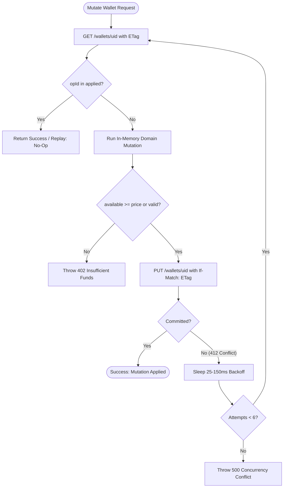

# Financial Ledger & Double-Entry Accounting

## 1. Core Principle: "Students Pay Strictly for Printed Pages"

The core financial guarantee of this platform is absolute:
> *"Even if a student generates an OTP but walks away or never prints, their balance is not deducted. They pay strictly for paper that emerges from the physical printer."*

To uphold this in a distributed serverless environment without multi-database transactions, the system implements an **Authoritative CAS Ledger** using:
1. **Integer Taka**: All monetary amounts are whole numbers (integer BDT). No floating point arithmetic ever touches a balance.
2. **Two-Phase Reservation (Hold -> Settle/Release)**: Funds are quarantined during minting and settled only upon physical confirmation.
3. **Colocated Idempotency Key**: Every mutation records its operation ID (`applied[opId]`) in the exact same Compare-And-Swap atomic write as the balance itself.

---

## 2. Mathematical Model & State Equations

Every user wallet contains:
- `balance`: Real uncommitted money owned by the student.
- `reserved`: Money locked for currently active, unprinted OTPs.
- `applied`: Replay guard map `{ [opId]: timestamp }`.

The **Available Balance** is the sole number spendable by the student:
$$\text{available} = \max(0, \text{balance} - \text{reserved})$$

### Mutation Rules Matrix

| Operation | Trigger | Effect on `balance` | Effect on `reserved` | Effect on `available` | Ledger Row Written |
| :--- | :--- | :--- | :--- | :--- | :--- |
| **Top-up** | Admin cash/bKash credit | $+A$ | $0$ | $+A$ | `top_<id>` ($+A$) |
| **Hold** | Student requests OTP | $0$ | $+P$ | $-P$ | *None* |
| **Settle** | Print history: Completed | $-P$ | $-P$ | $0$ | `chg_<jobId>` ($-P$) |
| **Release** | Code expired or cancelled | $0$ | $-P$ | $+P$ | *None* |
| **Late Settle** | Settle after release race | $-P$ | $0$ | $-P$ | `chg_<jobId>` ($-P$) |
| **Adjustment** | Admin correction/refund | $+\Delta$ | $0$ | $+\Delta$ | `adj_<id>` or `ref_<id>` |

---

## 3. The Compare-And-Swap (CAS) Algorithm

### Idempotency Guarantee
Because `applied[opId]` is written in the exact same payload as `balance` and `reserved`, if a network timeout occurs after Firebase committed the write, a subsequent retry will read the wallet, detect `hasApplied(opId) === true`, and safely return success without repeating the financial deduction.

---

## 4. The 20 Financial Invariants Catalog

- **INV-1 (Payment Condition)**: Only a print history row with `Print Status: Completed` deducts balance.
- **INV-2 (Hold Balance Neutrality)**: Minting an OTP increases `reserved` by job price; `balance` remains strictly unchanged.
- **INV-3 (Available Balance Formula)**: `available = max(0, balance - reserved)`. All pre-flight checks evaluate against `available`.
- **INV-4 (No-Charge Expiry)**: Expired or unused OTPs release `reserved`; no debit and no credit rows are written.
- **INV-5 (Atomic CAS)**: All wallet mutations execute via HTTP ETag Compare-And-Swap.
- **INV-6 (Delete Before Release)**: Expired jobs must be successfully deleted from UprintBD before `reserved` is released.
- **INV-7 (Bailout on Provider Error)**: If UprintBD print history cannot be fetched, reconciliation bails out immediately without modifying any holds.
- **INV-8 (Integer Currency)**: All balances, reservations, and prices are integer Taka.
- **INV-9 (Idempotent Settle)**: Re-running `settle` on an already settled job produces no change in balance or reserved.
- **INV-10 (Pre-Flight Hold)**: Hold must be committed to RTDB *before* document is uploaded to UprintBD.
- **INV-11 (Server Page Count)**: Page counts and price snapshots are computed server-side from raw PDF bytes.
- **INV-12 (OTP Masking)**: Kiosk OTP is masked in public API responses unless job status is `reserved`.
- **INV-13 (Serialized Uploads)**: Document uploads to UprintBD are queued sequentially per cookie jar.
- **INV-14 (Admin Email Match)**: Administrative endpoints require exact case-insensitive match with `ADMIN_EMAIL`.
- **INV-15 (Single Authoritative Source)**: RTDB is the single source of truth for financial balances and job states.
- **INV-16 (Compensating Release)**: If UprintBD upload or queue fails, the reserved hold is immediately released.
- **INV-17 (Unmatched Print Detection)**: Any completed print in UprintBD history not found in `printIndex` is flagged in `admin/uprint/unmatched`.
- **INV-18 (Double-Release Prevention)**: Releasing a hold cannot drive `reserved` below zero.
- **INV-19 (Settle After Release Recovery)**: If a print completes after an OTP was marked expired, `settle` debits `balance` without driving `reserved` negative.
- **INV-20 (Replay Guard Pruning)**: `applied` records are bounded with a 24-hour TTL and maximum 100 entries.
