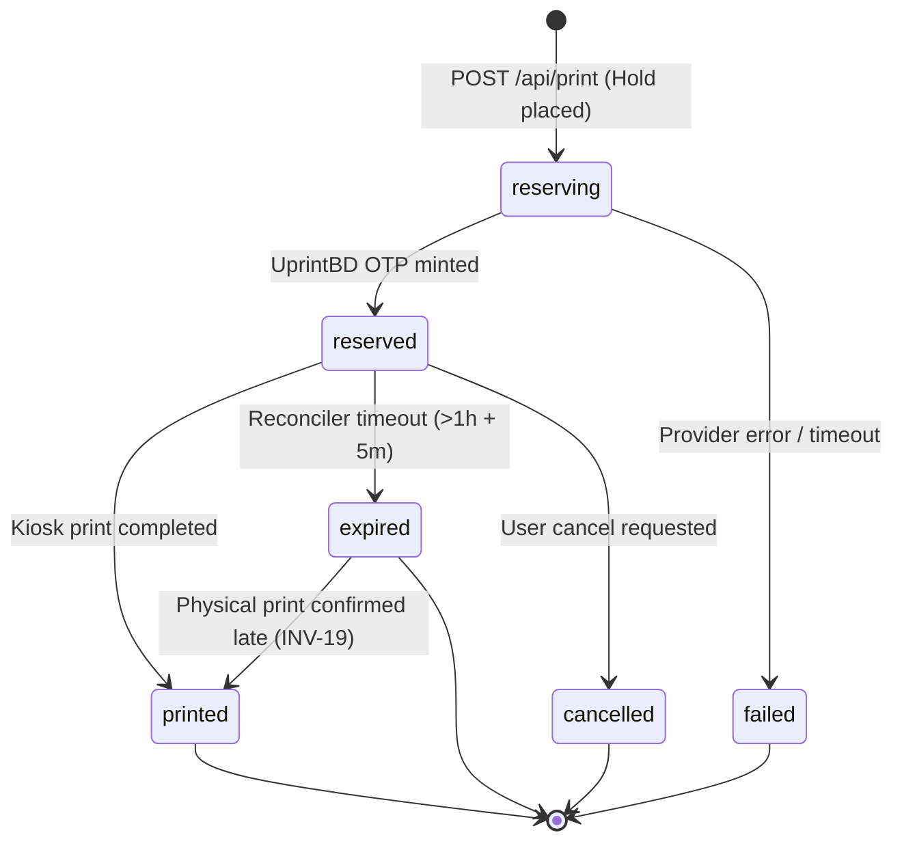

# Print Job Lifecycle & State Machine

## 1. Print Job States Overview

Every print request transitions through a strict, deterministic state machine:



### State Definitions

| Status | Meaning | Money State | OTP Visibility |
| :--- | :--- | :--- | :--- |
| **`reserving`** | Hold placed in wallet; uploading document to UprintBD. | Held in `reserved` | Masked (`null`) |
| **`reserved`** | UprintBD issued OTP; student may enter code at kiosk. | Held in `reserved` | **Visible** (6 digits) |
| **`printed`** | Physical paper printed; settled from UprintBD history. | Charged from `balance` | Masked (`null`) |
| **`expired`** | OTP expired unused; deleted from kiosk and hold freed. | Released to `available` | Masked (`null`) |
| **`failed`** | Provider refused upload or timed out; hold released. | Released to `available` | Masked (`null`) |
| **`cancelled`** | Student cancelled code; deleted from kiosk and hold freed.| Released to `available` | Masked (`null`) |

---

## 2. Valid Transition Matrix

The `PrintJob` domain entity enforces valid transitions:

```javascript
const VALID_TRANSITIONS = {
  reserving: ['reserved', 'failed'],
  reserved:  ['printed', 'expired', 'cancelled'],
  expired:   ['printed'], // Edge case: student typed code right as cron fired
  failed:    [],
  printed:   [],
  cancelled: [],
};
```

Attempts to execute illegal transitions (e.g. `printed` -> `cancelled`) throw `DomainError('Cannot transition print job from printed to cancelled', 409)`.

---

## 3. Filename as the Universal Joining Key

UprintBD's web dashboard and print history do not expose or accept external UUIDs. Furthermore, the print history table records only the uploaded filename, timestamp, and cost.

To reliably correlate completed physical prints back to internal student jobs:
- Every uploaded document receives an authoritative, cryptographically deterministic filename:
  $$\text{filename} = \text{sanitize}(\text{stem}) + \text{"\_"} + \text{jobId.slice}(-6).\text{toUpperCase}() + \text{".pdf"}$$
  *Example*: `Cover_EEE418_A1B2C3.pdf`
- The system indexes the normalized filename in RTDB under:
  `/printIndex/<fileKey> -> { uid, jobId, at }`
- During reconciliation, UprintBD print history rows are matched by normalized filename against `printIndex`.

---

## 4. Invariant INV-12: OTP Masking

To prevent students from sharing expired or unreserved OTPs or relying on stale screen captures:
- When a job is in `reserving`, `printed`, `expired`, `failed`, or `cancelled` state, the `otp` attribute is masked to `null` in public responses (`GET /api/jobs` and `GET /api/me`).
- The OTP is revealed **only** while the job is in `reserved` state.
