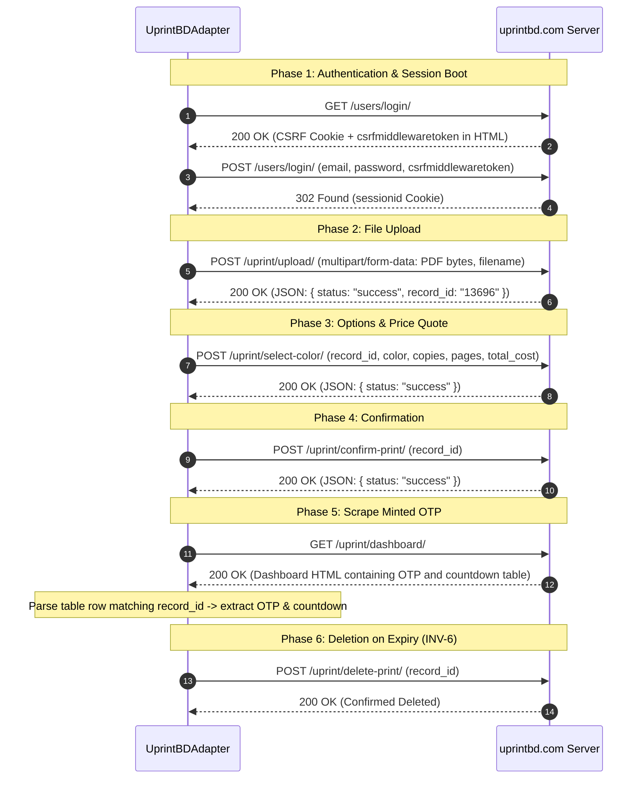

# UprintBD Protocol & Provider Adapter Architecture

## 1. Overview

UprintBD (`https://uprintbd.com`) operates self-service printing kiosks across universities in Bangladesh. It does not provide an official REST API.

The platform interacts with UprintBD via an authoritative infrastructure adapter (`lib/infrastructure/uprint/adapter.js`) that implements the formal `PrintProvider` domain interface (`lib/domain/print-provider.js`). No application services or API routes have direct knowledge of UprintBD HTML, forms, cookies, or endpoints.

---

## 2. Reverse-Engineered HTTP Protocol & Flow

The interaction sequence consists of 6 discrete phases:

---

## 3. Payload & Type Requirements

UprintBD's Django backend strictly validates payload types for `/uprint/select-color/`:

| Parameter | Type | Required Value / Format | Note |
| :--- | :--- | :--- | :--- |
| `record_id` | String | e.g. `"13696"` | Internal UprintBD record identifier |
| `color` | String | `"color"` or `"black_and_white"` | Must match radio button values |
| `copies` | Number/String | `1` to `10` | Number of copies |
| `pages` | String | `"all"` | All pages printed |
| `scale` | String | `"false"` | Must be string `"false"`, NOT boolean `false` |
| `pagesPerSheet` | Number | `1` | Must be numeric integer `1`, NOT string `"1"` |
| `total_cost` | Number | $\text{pages} \times \text{copies} \times \text{unitPrice}$ | Must equal internal calculator (3 mono / 5 color) |

---

## 4. Parser Specifications & Fixture Verification

The adapter parses raw HTML using high-performance, regex-based DOM utilities (`lib/infrastructure/uprint/parsers.js`):

1. **`extractCsrfInput(html)`**: Extracts `<input type="hidden" name="csrfmiddlewaretoken" value="..."/>`.
2. **`parseBalance(html)`**: Extracts institutional wallet balance from dashboard header.
3. **`parseCountdownCell(text)`**: Handles countdown timer formats:
   - Clock format `MM:SS` (e.g. `"45:30"` -> $45 \times 60 + 30 = 2730$ seconds)
   - Clock format `HH:MM:SS` (e.g. `"01:15:00"` -> 4500 seconds)
   - Bare integer seconds (e.g. `"3600"` -> 3600 seconds)
4. **`parsePrintHistory(html)`**: Parses `<table class="...table-bordered...">` rows in `/uprint/print_history/`.
   - Extracts: `dateTime` (Asia/Dhaka format), `filename`, `status`, `cost`, `deviceId`.

---

## 5. Invariant INV-13: Serialized Upload Queue

UprintBD maintains state per cookie session. If two concurrent upload requests post documents simultaneously under the same session ID, the server may assign the same or crossed `record_id` instances.

The `SessionQueue` (`lib/infrastructure/uprint/session-queue.js`) serializes all upload operations through an isolated Promise chain, while allowing read operations (`getPrintHistory`, `getAccountBalance`) to execute concurrently.
